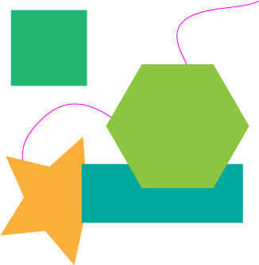

# Illlustrator Point Exporter
Export [x, y] anchor point coordinates as JSON from Adobe Illustrator.

- [Features](#features)
- [Usage](#usage)
- [Example output](#example-output)
- [Contributing](#contributing)

Tested on versions 19.2.0, 21.1.0, 22.0.1., 22.1.0.

## Features
- Points are organized by path and layer.
- Nested layers are supported.
- Z-order, and path areas and centroids are included.
- Layer, path, or point names are preserved in the output.

## Usage
1. Clone/download this repo locally.
2. In Illustrator, File > Scripts > Other Script and locate [`dist/exporter.js`](dist/exporter.js).
3. Name and save your JSON export.

## Example output
This [Illustrator file](test/test.ai):



Will produce this JSON (pretty-printed here for clarity):
```json
{
  "layers": [
    {
      "name": "Level 1 layer",
      "zOrderPosition": 1,
      "layers": [
        {
          "name": "Polygons",
          "zOrderPosition": 2,
          "paths": [
            {
              "name": "Hexagon",
              "area": 20977.0556936124,
              "points": [
                [
                  203.620465653063,
                  284.760368663594
                ],
                [
                  158.692544209353,
                  206.942926044627
                ],
                [
                  203.620465653063,
                  129.125483425658
                ],
                [
                  293.476308540483,
                  129.125483425658
                ],
                [
                  338.404229984191,
                  206.942926044627
                ],
                [
                  293.476308540483,
                  284.760368663594
                ]
              ],
              "centroid": [
                248.548387096773,
                206.942926044626
              ]
            },
            {
              "name": "Rectangle",
              "area": 14950.4130476334,
              "points": [
                [
                  330.57603686636,
                  328.539170506912
                ],
                [
                  127.811059907835,
                  328.539170506912
                ],
                [
                  127.811059907835,
                  254.806451612902
                ],
                [
                  330.57603686636,
                  254.806451612902
                ]
              ],
              "centroid": [
                229.193548387097,
                291.672811059907
              ]
            },
            {
              "name": "Square",
              "area": 9099.57739599474,
              "points": [
                [
                  134.26267281106,
                  156.188940092165
                ],
                [
                  38.8709677419356,
                  156.188940092165
                ],
                [
                  38.8709677419356,
                  60.7972350230411
                ],
                [
                  134.26267281106,
                  60.7972350230411
                ]
              ],
              "centroid": [
                86.5668202764978,
                108.493087557603
              ]
            }
          ]
        },
        {
          "name": "Level 2 layer",
          "zOrderPosition": 1,
          "layers": [
            {
              "name": "Level 3 layer",
              "zOrderPosition": 2,
              "layers": [
                {
                  "name": "Paths",
                  "zOrderPosition": 1,
                  "paths": [
                    {
                      "name": "Squiggle",
                      "area": -6237.87933487678,
                      "points": [
                        [
                          350.391705069123,
                          49.2764976958515
                        ],
                        [
                          254.539170506911,
                          117.47926267281
                        ],
                        [
                          234.262672811059,
                          235.451612903225
                        ],
                        [
                          80.8064516129016,
                          195.359447004607
                        ],
                        [
                          64.2165898617495,
                          310.566820276497
                        ]
                      ],
                      "centroid": [
                        25.293199202684,
                        246.13710365416
                      ]
                    }
                  ]
                }
              ]
            },
            {
              "name": "Points",
              "zOrderPosition": 1,
              "paths": [
                {
                  "name": "Point 1",
                  "area": 0,
                  "points": [
                    [
                      294.631336405528,
                      230.843317972349
                    ]
                  ],
                  "centroid": [
                    null,
                    null
                  ]
                },
                {
                  "name": "Point 2",
                  "area": 0,
                  "points": [
                    [
                      269.7465437788,
                      60.7972350230411
                    ]
                  ],
                  "centroid": [
                    null,
                    null
                  ]
                },
                {
                  "name": "Point 3",
                  "area": 0,
                  "points": [
                    [
                      200,
                      151.119815668202
                    ]
                  ],
                  "centroid": [
                    null,
                    null
                  ]
                }
              ]
            }
          ],
          "paths": [
            {
              "name": "PathItem",
              "area": 10630.6634270187,
              "points": [
                [
                  118.474654377878,
                  381.907834101381
                ],
                [
                  81.8829964485049,
                  338.881193167344
                ],
                [
                  25.6943079861912,
                  344.632066924605
                ],
                [
                  55.3076310682682,
                  296.535368949346
                ],
                [
                  32.4749654805391,
                  244.873868368682
                ],
                [
                  87.3686635944687,
                  258.175115207372
                ],
                [
                  129.445988669805,
                  220.495678181436
                ],
                [
                  133.758836790312,
                  276.81299879576
                ],
                [
                  182.596719430278,
                  305.187326617433
                ],
                [
                  130.368508043138,
                  326.692098073721
                ]
              ],
              "centroid": [
                97.7373271889382,
                299.419354838708
              ]
            }
          ]
        }
      ]
    }
  ]
}
```

## Contributing

Clone this repo, install dependencies, run `build` script:

```sh
$ npm install
$ npm run build
```

Work on [`src/exporter.js`](src/exporter.js).

Useful references:
- [Scripting for Illustrator Tutorial](https://github.com/jtnimoy/scripting-for-illustrator-tutorial)
- [Illustrator Scripting Guide](http://www.adobe.com/devnet/illustrator/scripting.html)
- [Illustrator Scripting References (PDFs)](reference/)
